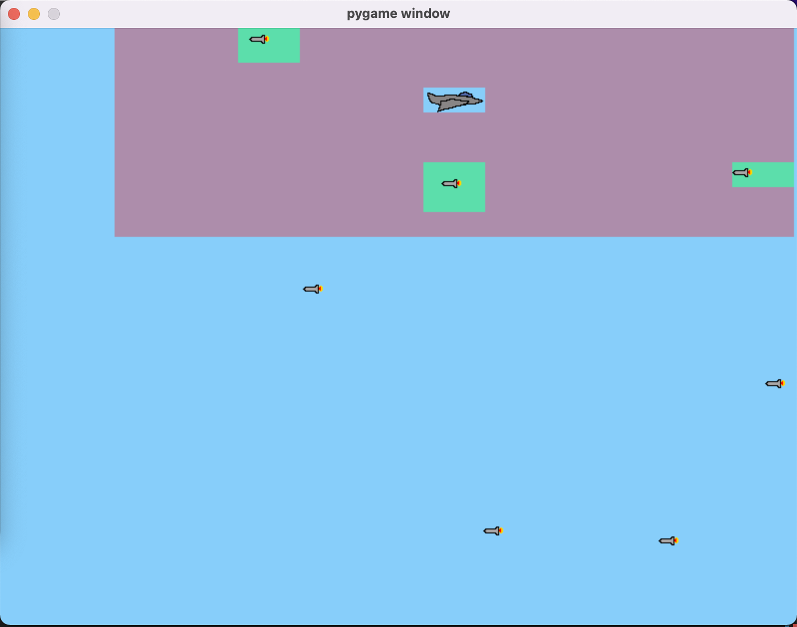

# ml-self-flying-jet
A project testing Deep Q Learning algorithm to perform
reinforcement learning in a plane flight simulator. 
The aim of the game is to avoid as many rockets as possible. 
The rockets come from the right-hand side of the screen to the left.

The game was designed thanks to [this tutorial](https://realpython.com/pygame-a-primer/)

# Overview


The screenshot shows a moment of model training. The red zone around the plane is a radar which stands for the game state, based on which, the model is learning how to react. When rocket enters the radar area the background color is changed to green, showing where the danger is at the moment.

# Usage

```
Usage: main.py [OPTIONS]

Play flight game or train a neural network that will  learn how to avoid
obstacles (rockets) and collect as many  points as possible.

Run training example: 
python3 --train

Play game by yourself example: 
python3 --play

Options:
  --play      Play the game by yourself
  --training  Run a training session
  --radar     Show radar around the plane
  --help      Show this message and exit.
```